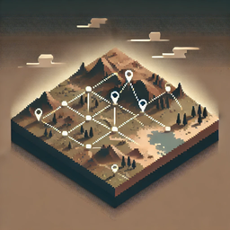

  

<h1 align="center">Valheim-Atlas</h1>

  
  

  A Valheim mod that enables real-time map sharing between all players on a server. 
  Explore together, share pins automatically - one map for all!

## Features

- **Shared Fog of War** - Exploration is automatically shared between all players
- **Shared Map Pins** - Pins placed by any player are visible to everyone
- **Configurable** - Extensive configuration options for server admins
- **Persistent** - Map data is saved and persists across server restarts
- **Efficient** - Uses chunked data with compression for minimal network overhead

## Installation

### Thunderstore (Recommended)
Install via [r2modman](https://valheim.thunderstore.io/package/ebkr/r2modman/) or [Thunderstore Mod Manager](https://www.overwolf.com/app/Thunderstore-Thunderstore_Mod_Manager).

### Manual
1. Install [BepInEx](https://valheim.thunderstore.io/package/denikson/BepInExPack_Valheim/)
2. Install [Jotunn](https://valheim.thunderstore.io/package/ValheimModding/Jotunn/)
3. Place `Atlas.dll` in `BepInEx/plugins/`

**Note:** All players and the server must have the mod installed.

## Configuration

### BepInEx Config (`BepInEx/config/com.atlas.valheim.cfg`)

| Setting | Default | Description |
|---------|---------|-------------|
| EnableExplorationSharing | true | Toggle fog of war sharing |
| EnablePinSharing | true | Toggle pin sharing |
| ForcePublicPosition | false | Force all players visible on map |

### JSON Config (`BepInEx/config/Atlas.json`)

Server-enforced settings:

| Setting | Default | Description |
|---------|---------|-------------|
| ExplorationRadiusMultiplier | 100 | Exploration radius percentage |

## Contributing

See [CONTRIBUTING.md](CONTRIBUTING.md) for development setup and guidelines.

## Acknowledgments

- Built using [JotunnModStub](https://github.com/Valheim-Modding/JotunnModStub) template
- Powered by [Jötunn](https://valheim-modding.github.io/Jotunn/) - the Valheim Library
- [BepInEx](https://github.com/BepInEx/BepInEx) - Unity game patcher and plugin framework

## License

[MIT](LICENSE) © Slatyo
